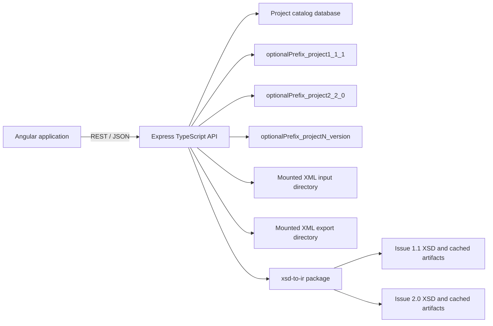

# S3000L CRUD Application Implementation Plan

## 1. Objective

Build a metadata-driven CRUD application for S3000L Issue 1.1 and Issue 2.0 using:

- the existing Angular frontend project;
- the existing Express/TypeScript backend at `/home/pbx06/work/test/backend`;
- MariaDB, with one generated database per project;
- `xsd-to-ir` as the authoritative source for IR, JSON Schema, MariaDB DDL, XML validation, XML-to-database import, baseline XML export, and visualization metadata.

The application must support an arbitrary number of projects. Each project is permanently associated with one S3000L issue and receives its own database. With `DB_PROJECT_PREFIX` left empty, for example:

- project `project1`, Issue 1.1 -> database `project1_1_1`;
- project `project2`, Issue 2.0 -> database `project2_2_0`.

Issue selection is immutable after project creation because the two generated schemas overlap in table names but differ structurally.

## 2. Confirmed Decisions

1. MariaDB is greenfield and project databases are provisioned by the application.
2. There is no browser upload workflow. XML inputs are files mounted on the backend/NAS.
3. The backend already lists and reads mounted XML files; this work will turn that into an explicit, project-scoped import workflow.
4. The first export feature is a complete baseline (`msgType = B`) XML export. Net-change export is deferred.
5. The backend depends on `xsd-to-ir`; application code must consume its public API and must not duplicate schema interpretation.
6. The frontend will use Angular. Its source is not available on this computer, so frontend paths and framework-version-specific choices must be confirmed when that repository is available.
7. Add an `editor` role and LSA-specific permissions.

## 3. Scope

### In scope

- Create and list projects.
- Provision a separate MariaDB database from the selected Issue 1.1 or 2.0 XSD.
- Expose metadata-driven entity, field, relation, island, and collection descriptions.
- Generic browse, create, read, update, and soft-delete operations for editable record entities.
- Relationship selection and child-record editing based on IR multiplicity and direction.
- Validate writes against IR and generated JSON Schema.
- List, inspect, validate, and import mounted XML files into a selected project.
- Generate, validate, persist, and download baseline XML exports.
- Audit project provisioning, CRUD changes, imports, and exports.
- Enforce project-aware authorization.

### Deferred

- Browser file upload.
- Net-change (`msgType = U`) export and export sequence management.
- Hard deletion of S3000L records or project databases.
- Changing a project's S3000L issue after creation.
- Editing XSDs or the generated IR.
- A bespoke screen for every S3000L entity in the first release.

## 4. Target Architecture



The existing `DB_NAME` database becomes the control/catalog database. It stores project metadata and operational history, but not project S3000L data. Each project database contains only the DDL generated for its selected issue.

The backend loads both dialects at startup, builds and caches each IR once, and derives the following immutable artifacts:

- MariaDB DDL;
- JSON Schema draft-07;
- browser-safe visualization metadata, including islands;
- schema fingerprint;
- editable-entity and relationship metadata.

Every project request resolves `projectId -> catalog row -> dialect -> physical database`. Clients never provide a raw database identifier to CRUD endpoints.

## 5. Component A: `xsd-to-ir` Dependency

This component must be stabilized before project provisioning or generic CRUD work begins.

### A1. Correct and formalize the public package API

- Correct the current `s30001` asset directory and filename typo to `s3000l`.
- Introduce the correctly named `getS3000LSchemaPath('1.1' | '2.0')` export.
- Keep `getS30001SchemaPath` temporarily as a deprecated compatibility alias if backend work already references it.
- Export all backend-required functions from `lib.js`:
  - `parseXSD`;
  - `IRBuilder`;
  - `generateSQL`;
  - `generateJSONSchema`;
  - `buildVisualizationModel` and `buildNeighborhood`;
  - `deserializeXML`;
  - `serializeToXML` and `XMLSerializer`;
  - `validateXML` and `validateXMLSync`;
  - `DBAdapter`;
  - schema asset resolvers.
- Add a TypeScript declaration file and a `types` entry in `package.json`. Remove the backend's need to infer everything as `any` through `allowJs`.
- Define and export a dialect type such as `S3000LDialect = '1.1' | '2.0'`.

### A2. Make the package deployable

- Add a `files` allowlist to publish runtime source, declarations, XSD assets, visualizer assets if still public, and required package metadata only.
- Exclude tests, temporary output, local reports, and the large standards PDF unless it is demonstrably required at runtime.
- Use a pinned package version from the organization's package registry for CI and production.
- Keep `file:../../xsd-to-ir` only for local linked development. It will not work with the backend's current isolated Docker build context.
- Add a package provenance field to backend startup logs and project records: package version plus schema fingerprint.

### A3. Add artifact and compatibility tests

For both issues:

- resolve the bundled XSD path;
- parse the XSD and build the IR;
- generate DDL and JSON Schema;
- serialize the visualization model with no `Map`, cycle, or non-JSON value;
- assert all relation targets resolve;
- verify the expected entity/relation/enum counts with regression fixtures;
- apply generated DDL to MariaDB;
- import a representative XML file;
- export a baseline XML document and validate it against the same issue XSD.

The public API and generated artifact fingerprints become compatibility contracts. Breaking changes require a new package version and a migration decision.

## 6. Component B: Backend (Express/TypeScript)

Backend root: `/home/pbx06/work/test/backend`

### B1. Suggested module layout

```text
src/
  modules/
    projects/
      project.model.ts
      project.repository.ts
      project.service.ts
      project.routes.ts
      project.validation.ts
    schema/
      schema-registry.service.ts
      schema.routes.ts
    records/
      record.repository.ts
      record.service.ts
      record.routes.ts
      record.validation.ts
    imports/
      import.model.ts
      import.service.ts
      import.routes.ts
    exports/
      export.model.ts
      baseline-export.service.ts
      export.routes.ts
    audit/
      audit.repository.ts
    authorization/
      lsa-permissions.ts
      require-permission.ts
  database/
    catalog.pool.ts
    project-database.registry.ts
    provisioner.pool.ts
  integrations/
    xsd-to-ir/
      dialect-artifacts.ts
      xsd-to-ir.types.ts
```

The names may be adapted to the existing backend conventions, but schema registry, catalog access, project database routing, and record CRUD must remain separate responsibilities.

### B2. Configuration

Add validated environment variables:

- `DB_CATALOG_NAME` (or retain `DB_NAME` with an explicit catalog meaning);
- `DB_PROJECT_PREFIX`, optional namespace prepended to every generated project database name;
- `DB_PROVISIONER_USER` and `DB_PROVISIONER_PASSWORD`;
- `DB_PROJECT_USER` and `DB_PROJECT_PASSWORD` if runtime access uses a separate account;
- `NAS_XML_IMPORT_PATH`, replacing ambiguous path naming;
- `NAS_XML_EXPORT_PATH`;
- maximum project connection pools and idle timeout;
- import/export size and duration limits.

Use a dedicated provisioning connection with the minimum privileges required to create databases and apply DDL. Normal requests use a runtime account with DML access. Do not expose environment configuration through `/api/env`; remove that route or restrict it to non-secret, explicitly allowlisted diagnostics for administrators.

`DB_PROJECT_PREFIX` identifies databases owned by this application and helps avoid collisions with unrelated databases on a shared MariaDB server. It does not select a database and is not supplied by the frontend. The backend reads it once from configuration and inserts separators itself. Configure `lsa`, not `lsa_`.

Recommended production configuration:

```env
DB_PROJECT_PREFIX=lsa
```

Examples:

| Prefix | Project slug | Issue | Generated database |
| --- | --- | --- | --- |
| empty | `project1` | 1.1 | `project1_1_1` |
| `lsa` | `project1` | 1.1 | `lsa_project1_1_1` |
| `lsa` | `project2` | 2.0 | `lsa_project2_2_0` |
| `test_lsa` | `project1` | 1.1 | `test_lsa_project1_1_1` |

Normalize the configured prefix with the same identifier rules as project slugs: lowercase ASCII letters, digits, and underscores only; no leading or trailing underscores; no reserved words. An empty value is valid when the MariaDB instance is dedicated to this application. Include the prefix when checking the final MariaDB identifier length.

### B3. Schema registry

Create a singleton `SchemaRegistryService` which, at startup:

1. resolves the two bundled XSDs through `getS3000LSchemaPath`;
2. builds the IR once for each dialect;
3. generates DDL, JSON Schema, and visualization metadata;
4. computes a SHA-256 fingerprint over the normalized artifacts;
5. verifies that every relation target exists;
6. stores immutable artifacts in a map keyed by dialect.

The application must fail startup if either required dialect cannot be loaded. Parsing XSDs on each HTTP request is prohibited.

### B4. Project catalog

Create catalog migrations for at least:

#### `lsa_projects`

- `id` UUID or BIGINT primary key;
- `slug` unique logical identifier;
- `display_name`;
- `dialect` enum/string: `1.1` or `2.0`;
- `database_name` unique;
- `status`: `provisioning`, `ready`, `failed`, `archived`;
- `schema_fingerprint`;
- `xsd_to_ir_version`;
- `provision_error`, nullable and sanitized;
- `created_by`, `created_at`, `updated_at`.

#### `lsa_import_jobs`

- project, source filename, size, source timestamp/hash;
- detected and expected dialect;
- message metadata (`msgId`, `msgType`, `msgStatus`, date);
- validation engine/result;
- inserted/updated/deleted counts;
- status, error summary, actor, timestamps.

#### `lsa_export_jobs`

- project, type (`baseline` initially), message metadata;
- selected collections, output filename/path/hash/size;
- validation result;
- status, error summary, actor, timestamps.

#### `lsa_audit_events`

- project, actor, action, entity, record UID;
- request/correlation ID;
- safe before/after summaries or changed-field list;
- timestamp.

Do not store credentials or arbitrary filesystem paths in these tables.

### B5. Safe database naming and provisioning

The create-project request accepts `slug`, `displayName`, and `dialect`; it never accepts `databaseName`.

Derive the physical name as:

```text
databaseName = joinWithUnderscore(
  nonEmpty(normalize(DB_PROJECT_PREFIX)),
  normalize(projectSlug),
  dialect.replace(".", "_")
)
```

For example, `DB_PROJECT_PREFIX=lsa`, project slug `project1`, and Issue 1.1 produce `lsa_project1_1_1`. When the prefix is empty, the same request produces `project1_1_1`.

Allowed normalized characters are lowercase ASCII letters, digits, and underscores. Reject reserved words, empty project slugs, names over the configured limit, and collisions. Quote identifiers in provisioning code even after validation.

Provisioning workflow:

1. Authorize `lsa:project:create`.
2. Validate and reserve the project row with `status = provisioning`.
3. Acquire a project-specific advisory lock to prevent duplicate provisioning.
4. Create the database with `utf8mb4` and a documented collation.
5. Apply the cached DDL for the selected dialect.
6. Run a schema health check and store the fingerprint.
7. Mark the project `ready`.
8. If a step fails, mark it `failed` with a sanitized diagnostic and allow an idempotent administrator retry.

MariaDB database DDL is not fully transactional. Do not advertise project deletion as rollback. An administrator cleanup procedure can remove an empty failed database after explicit confirmation, but that is outside the first API release.

### B6. Project database registry

- Resolve every project from the trusted catalog before opening a connection.
- Create one bounded Knex pool per active project database.
- Cache pools with an LRU/idle policy and a global maximum to support an arbitrary project count without holding an arbitrary connection count.
- Close project pools during application shutdown.
- Reject data requests unless the catalog status is `ready`.
- Construct one `DBAdapter` per project context using the project's cached IR and Knex connection.
- Include `projectId` and dialect in request logs, never database credentials.

### B7. Metadata API

Return frontend-safe metadata derived from `buildVisualizationModel`, augmented only with UI policy. Suggested endpoints:

| Method | Route | Purpose |
| --- | --- | --- |
| `GET` | `/api/schema/dialects` | Supported dialects and artifact versions |
| `GET` | `/api/projects/:projectId/schema` | Project dialect, fingerprint, statistics, sections, collections, islands, and entities |
| `GET` | `/api/projects/:projectId/schema/entities/:entityName` | Fields, constraints, references, relations, and UI hints |
| `GET` | `/api/projects/:projectId/schema/islands` | Island list and estimated top-level CRUD screen count |

Mark each entity as one of:

- editable record entity;
- synthetic/flattened helper, editable through its parent only;
- lookup/enum;
- internal/non-editable.

Do not count every IR entity as an independent CRUD screen. The visualizer's `recordEntity` and island metadata provide the starting point; apply explicit exclusions for envelope-only and implementation-only structures.

### B8. Generic record API

Suggested endpoints:

| Method | Route | Purpose |
| --- | --- | --- |
| `GET` | `/api/projects/:projectId/entities/:entityName/records` | Page, filter, and sort active rows |
| `POST` | `/api/projects/:projectId/entities/:entityName/records` | Create a record |
| `GET` | `/api/projects/:projectId/entities/:entityName/records/:uid` | Read a record and relation summaries |
| `PATCH` | `/api/projects/:projectId/entities/:entityName/records/:uid` | Update editable fields and supported relationships |
| `DELETE` | `/api/projects/:projectId/entities/:entityName/records/:uid` | Soft-delete a record |
| `GET` | `/api/projects/:projectId/entities/:entityName/records/:uid/relations/:relationName` | Page related records |

Rules:

- Resolve table and column identifiers exclusively from IR metadata; never interpolate a client-provided identifier directly into SQL.
- Permit CRUD only on entities classified as editable record entities.
- Use `uid` as the public record identifier. Never expose internal numeric IDs as API identifiers.
- Exclude `_created_at`, `_updated_at`, `_deleted_at`, `_msg_seq`, primary keys, and generated foreign-key columns from editable payloads.
- Support allowlisted equality, text, enum, date/range, and relation filters according to field type.
- Use cursor or stable keyset pagination for large tables; a simple limit/offset implementation is acceptable only for the first vertical slice.
- Return a consistent error envelope containing code, message, field errors, and request ID.
- Use `_updated_at` as an optimistic concurrency token, exposed as an ETag/version. Reject stale updates with HTTP 409.
- Continue using `DBAdapter` for insert, update, soft-delete, relation resolution, and import persistence. Add narrowly scoped repository queries for pagination and optimistic locking where the adapter does not yet provide them.

### B9. Validation

Use layered validation:

1. Zod validates route params, query strings, and transport DTO shape.
2. IR metadata rejects unknown/non-editable fields and coerces only documented scalar types.
3. Generated JSON Schema validates entity content with Ajv draft-07.
4. Existing database constraints remain the final integrity boundary.
5. XSD assertions not expressible in JSON Schema must be checked using the assertion metadata/validator before persistence when applicable.

Compile and cache one Ajv validator per dialect/entity. Do not regenerate schemas or compile validators per request.

### B10. Relationships and nested values

- Render and persist one-to-one and one-to-many links according to IR direction and multiplicity.
- For an ID/UID reference, validate that the target exists and belongs to the same project database.
- For required relations, prevent unlinking when `minOccurs > 0`.
- Treat synthetic flattened-group entities as nested child editors, not standalone items in the primary navigation.
- Treat LONGTEXT fields marked as JSON objects as structured nested controls, serialize them canonically, and validate them before storage.
- Do not infer entity links from similarly named fields. For example, XML containment fields such as `messageContentItems` are not relationships unless the IR contains a resolved relation edge.

### B11. Mounted XML import

Refactor the current XML service so read-only actions and database mutations are separate. A `GET /xml-files/:fileName` request must not import data.

Suggested endpoints:

| Method | Route | Purpose |
| --- | --- | --- |
| `GET` | `/api/xml-files` | List mounted XML files and safe metadata |
| `GET` | `/api/xml-files/:fileName/inspection` | Detect issue, read message metadata, and validate without persistence |
| `POST` | `/api/projects/:projectId/imports` | Import one allowlisted mounted filename into the project |
| `GET` | `/api/projects/:projectId/imports` | List import history |
| `GET` | `/api/projects/:projectId/imports/:jobId` | Read import result |

Import workflow:

1. Resolve and authorize the target project.
2. Validate the filename and enforce that the resolved path remains under `NAS_XML_IMPORT_PATH`.
3. Read with configured size limits and calculate a content hash.
4. Detect the dialect from the document structure/schema location, then validate against the target project's exact XSD.
5. Reject dialect mismatch before opening a project transaction.
6. Deserialize with the cached project IR.
7. Persist through `DBAdapter.persistMessage` in one transaction.
8. Store message metadata, content hash, validation result, and mutation counts in the import job.
9. Make duplicate-import policy explicit: reject the same project/content hash by default, with an administrator override only if required later.

Do not enable structural validation fallback in production imports. A successful import requires the configured strict validator and a valid XSD result.

### B12. Baseline XML export

Suggested endpoints:

| Method | Route | Purpose |
| --- | --- | --- |
| `POST` | `/api/projects/:projectId/exports/baseline` | Generate a complete baseline XML export |
| `GET` | `/api/projects/:projectId/exports` | List export history |
| `GET` | `/api/projects/:projectId/exports/:jobId` | Read export status and metadata |
| `GET` | `/api/projects/:projectId/exports/:jobId/download` | Download a completed export |

Baseline request fields:

- `msgId`;
- `msgStatus` (`D`, `P`, or `F`);
- optional sending and receiving systems;
- optional collection subset, defaulting to all collections;
- requested output filename, normalized by the backend.

Export workflow:

1. Resolve project, IR, DB adapter, and selected collections.
2. Call `serializeToXML(ir, db, { msgType: 'B', ...metadata })`.
3. Validate the generated XML strictly against the project's bundled XSD.
4. Write to a temporary file under `NAS_XML_EXPORT_PATH`.
5. Atomically rename the file only after validation succeeds.
6. Store path-relative name, SHA-256, size, counts/collections, validation result, actor, and timestamps.
7. Stream downloads with safe `Content-Disposition`, no arbitrary path access, and authorization checks.

Failed output remains unavailable for download and temporary files are cleaned up. Baseline export does not modify `_msg_seq`; sequence handling is reserved for net-change export.

If export time is acceptable in request/response for the first vertical slice, keep the job synchronous internally while still persisting job state. Move it to a worker queue when production data establishes that it exceeds request timeouts.

### B13. Authorization and web security

Introduce permissions rather than scattering role checks:

| Role | Permissions |
| --- | --- |
| `admin` | `lsa:read`, `lsa:write`, `lsa:project:create`, `lsa:project:retry`, `lsa:import`, `lsa:export` |
| `editor` | `lsa:read`, `lsa:write`, `lsa:import`, `lsa:export` |
| `viewer` / `reader` | `lsa:read` |

Additional controls:

- Keep backend-terminated OIDC/session authentication.
- Add CSRF protection or strict origin plus CSRF token enforcement for state-changing cookie-authenticated routes.
- Rate-limit provisioning, import, and export endpoints.
- Set body-size limits and reject unknown JSON properties.
- Sanitize database, XML, and internal validation errors before returning them.
- Audit all mutations with authenticated actor and request ID.
- Do not return mounted directory paths, credentials, or full environment state to clients.

## 7. Component C: Angular Frontend

The frontend repository is not available on this machine. The first frontend task is a short architecture inventory: Angular version, standalone versus NgModule structure, router, UI component library, state management, API client conventions, authentication/session handling, and test tooling. Preserve established project conventions after that inventory.

### C1. Suggested feature structure

```text
src/app/
  core/
    api/
    auth/
    project-context/
    error-handling/
  features/
    projects/
    schema-browser/
    records/
    imports/
    exports/
  shared/
    dynamic-form/
    relation-picker/
    data-grid/
    field-renderers/
```

Use Angular reactive forms. If the existing project has no design system, Angular Material/CDK is the recommended default for tables, dialogs, trees, overlays, accessibility, and virtual scrolling.

### C2. Application shell and project context

- Project selector in the application header.
- Route project-aware pages under `/projects/:projectId/...`.
- Load project summary, dialect, status, and schema fingerprint into a project-context service.
- Reject or redirect data routes while a project is not `ready`.
- Display the active Issue 1.1/2.0 label prominently to prevent cross-project confusion.
- Preserve selected project, entity, filters, sort, and page state in URL query parameters where useful.

### C3. Project management

Admin-only project list and creation wizard:

1. enter display name and slug;
2. choose Issue 1.1 or Issue 2.0;
3. preview the derived database name;
4. review schema statistics and confirmation that issue selection is permanent;
5. submit and show `provisioning`, `ready`, or `failed` status;
6. allow an authorized retry for failed provisioning.

The UI requests creation; only the backend creates databases.

### C4. Navigation by section, collection, and island

- Reuse visualization metadata rather than maintaining a frontend entity catalog.
- Support primary/supporting section navigation, XML collection hierarchy, entity search, and island list.
- Show each island's entity count and estimated editable CRUD count.
- Searching for an entity such as `product` must reveal and select its containing island even if the island itself does not match the search text.
- Visually distinguish record entities, synthetic helpers, lookups, and non-editable structures.
- Optionally link to the existing focused relationship graph for schema exploration.

### C5. Generic record list

- Server-side pagination, sorting, and filter controls generated from field metadata.
- Column chooser with a small default column set: UID, useful labels, key status fields, and updated timestamp.
- Enum dropdown filters, date/range controls, nullable filters, and reference lookups.
- Row actions governed by permissions: view, edit, soft-delete.
- Virtual scrolling or paged rendering; never load an entire large entity table.
- Persist list state in URL query parameters.

### C6. Metadata-driven record form

Map IR/JSON Schema metadata to controls:

| Metadata | Angular control |
| --- | --- |
| string with enum | select/autocomplete |
| string | input/textarea according to length |
| date/date-time/time | matching date/time control |
| boolean | checkbox or select when nullable |
| number/integer | numeric input with min/max/step |
| pattern/length constraints | reactive validators and help text |
| one-to-one reference | searchable relation picker |
| one-to-many relation | paged child list/editor |
| synthetic flattened group | nested form/group editor |
| structured JSON value | nested object/array editor, not raw text by default |

Show XML name/kind, S3000L documentation, cardinality, and validation messages without exposing database-only details. Hide technical columns.

For large referenced entities, relation pickers must query the server and search by UID plus configured display fields rather than downloading all options.

### C7. Import user experience

- List mounted files with name, size, modification time, detected dialect, and validation status when inspected.
- Require selection of a target project before import.
- Clearly block and explain issue mismatches.
- Require confirmation because import mutates many records.
- Display job result, message metadata, and inserted/updated/deleted counts.
- Provide links to import history and affected project data.
- Do not include a file-upload control.

### C8. Baseline export user experience

- Baseline export dialog with message ID/status, party metadata, collection selection, and output filename.
- Default to all primary and supporting collections.
- Show generating, validating, complete, and failed states.
- Display dialect, output hash/size, validation result, and download action.
- Preserve export history for auditability.

### C9. Frontend API and error handling

- Generate or maintain typed API DTOs from an OpenAPI contract published by the backend.
- Add a single HTTP interceptor for credentials, CSRF token, correlation ID display, and standard error envelopes.
- Handle HTTP 409 optimistic concurrency conflicts with a reload/compare prompt.
- Use route guards for broad access and permission directives/services for individual actions; backend authorization remains authoritative.
- Cache immutable schema metadata by dialect/fingerprint and invalidate it when the fingerprint changes.

### C10. Accessibility and performance

- Keyboard-operable tables, dialogs, trees, and relation pickers.
- Proper labels and error association for generated controls.
- Angular CDK virtual scrolling for long schema/entity menus where needed.
- Lazy-load feature routes.
- Use `OnPush` or signals according to the existing Angular version and conventions.
- Avoid rendering the complete 193/286-entity graph in CRUD pages; use focused relationships and island/entity lists.

## 8. Component D: MariaDB and Runtime Infrastructure

### D1. Database identities

Use separate logical responsibilities:

- catalog migration/runtime identity;
- project provisioner identity;
- project CRUD identity.

The exact MariaDB grant strategy depends on deployment operations. It must permit creation and access only within the application's approved naming namespace. Avoid granting the web process `DROP DATABASE` in the initial release.

Update local Docker/MariaDB initialization, OpenShift secrets, Helm values, and deployment documentation together. Current grants scoped only to `propriateraydb.*` are insufficient for dynamic project databases.

### D2. Storage

- Mount import XML read-only.
- Mount export XML read-write at a separate path.
- Use a temporary export subdirectory on the same filesystem to preserve atomic rename behavior.
- Define retention and backup policies for exported XML and job history.
- Back up the catalog database and every project database; catalog backup alone is insufficient.

### D3. Observability

Add metrics/log fields for:

- project provisioning duration and failures;
- active/cached project pools;
- CRUD latency by entity without logging payload values;
- imported file size, duration, and row counts;
- baseline export duration, size, and validation result;
- schema fingerprint and `xsd-to-ir` version at startup.

Health checks should verify the catalog connection. A separate readiness check should also verify schema-registry initialization and the ability to create a project database connection; it should not query every project database.

## 9. API Contract Summary

Use a versioned API prefix such as `/api/v1`. A compact first contract is:

```text
GET    /schema/dialects
GET    /projects
POST   /projects
GET    /projects/:projectId
POST   /projects/:projectId/retry-provisioning
GET    /projects/:projectId/schema
GET    /projects/:projectId/schema/entities/:entityName
GET    /projects/:projectId/schema/islands

GET    /projects/:projectId/entities/:entityName/records
POST   /projects/:projectId/entities/:entityName/records
GET    /projects/:projectId/entities/:entityName/records/:uid
PATCH  /projects/:projectId/entities/:entityName/records/:uid
DELETE /projects/:projectId/entities/:entityName/records/:uid
GET    /projects/:projectId/entities/:entityName/records/:uid/relations/:relationName

GET    /xml-files
GET    /xml-files/:fileName/inspection
POST   /projects/:projectId/imports
GET    /projects/:projectId/imports
GET    /projects/:projectId/imports/:jobId

POST   /projects/:projectId/exports/baseline
GET    /projects/:projectId/exports
GET    /projects/:projectId/exports/:jobId
GET    /projects/:projectId/exports/:jobId/download
```

Publish the contract as OpenAPI and use it to align backend integration tests and Angular DTO generation.

## 10. Delivery Plan

### Phase 0: Dependency and current-backend stabilization

- Correct `xsd-to-ir` schema asset resolution and public names.
- Export SQL, JSON Schema, and visualization generators.
- Add TypeScript declarations and package publishing rules.
- Replace production use of the local file dependency with a pinned package artifact.
- Split the existing side-effecting XML `GET` route into inspection and import commands.
- Remove/restrict `/api/env`.
- Add real backend tests; the current Vitest command reports no test files.

**Exit criteria:** both schema paths resolve from the installed package, backend builds without untyped package APIs, and package contract tests pass.

### Phase 1: Project catalog and provisioning vertical slice

- Add catalog migrations and project repository.
- Add schema registry and startup artifact checks.
- Add secure database naming, provisioner pool, and project pool registry.
- Implement create/list/get/retry project APIs and permissions.
- Apply Issue 1.1 and 2.0 DDL to separate databases in integration tests.

**Exit criteria:** an admin can create one project for each issue, both reach `ready`, and their generated schemas/fingerprints match the selected dialect.

### Phase 2: Metadata and read-only browser

- Implement project schema/entity/island APIs.
- Implement generic record list/read API with filtering and pagination.
- Build Angular project selector, hierarchy/island navigation, record list, and record detail view.

**Exit criteria:** a viewer can locate `product`, see its island, browse its rows and relations, and switch safely between Issue 1.1 and 2.0 projects.

### Phase 3: CRUD editing

- Implement allowlisted create/update/soft-delete APIs.
- Add Ajv/IR validation, relation validation, optimistic concurrency, and audit events.
- Build dynamic Angular forms, relation pickers, nested synthetic-group editors, and conflict handling.

**Exit criteria:** an editor can complete representative scalar, enum, one-to-one, one-to-many, nested, and soft-delete scenarios in both dialects, with invalid and stale writes rejected.

### Phase 4: Mounted XML import

- Implement inspection and project-scoped import jobs.
- Add strict dialect/XSD validation, duplicate detection, audit data, and import history.
- Build the Angular mounted-file and import-result screens.

**Exit criteria:** valid files import transactionally into matching projects; mismatched, duplicate, traversal, oversized, and invalid files are safely rejected.

### Phase 5: Baseline export

- Implement baseline job records and `serializeToXML` integration.
- Add strict XSD validation, atomic filesystem publishing, safe download, and export history.
- Build Angular export dialog/history/download screens.

**Exit criteria:** both Issue 1.1 and 2.0 projects produce valid baseline XML that round-trips through the corresponding parser/validator.

### Phase 6: Hardening and release

- Add load/performance tests using realistic entity counts and row volumes.
- Verify CSRF, authorization, identifier allowlisting, traversal protection, and secret handling.
- Add backup/restore and failed-provisioning runbooks.
- Complete OpenShift/Helm configuration and production package delivery.
- Run accessibility and manual acceptance testing.

**Exit criteria:** security, recovery, observability, and acceptance checklists pass in the target environment.

## 11. Test Strategy

### `xsd-to-ir`

- Public API/type tests.
- Issue 1.1 and 2.0 artifact snapshot/fingerprint tests.
- MariaDB DDL integration tests.
- XML import/baseline export round-trip and strict XSD validation.

### Backend unit tests

- database-name normalization and collision rules;
- project state transitions;
- metadata/entity editability policy;
- field allowlisting/coercion;
- permission matrix;
- filename/path safety;
- import dialect detection and mismatch handling;
- export filename normalization.

### Backend integration tests

- provision one database for each issue;
- pool routing never crosses project databases;
- representative CRUD for scalar, enum, references, child collections, JSON objects, and soft delete;
- invalid payload, unresolved relation, stale ETag, and required relation failures;
- XML import transaction rollback on failure;
- strict baseline generation/validation/download;
- authorization and CSRF checks;
- OpenAPI response contract tests.

Use uniquely named disposable databases for tests and remove only those exact validated names in test teardown.

### Angular tests

- metadata-to-control mapping unit tests;
- project context and route tests;
- record list/filter/pagination component tests;
- generated form validation and relation picker tests;
- import and export workflow tests;
- permission visibility and 409 conflict handling;
- end-to-end happy paths for one Issue 1.1 and one Issue 2.0 project.

### Manual acceptance scenarios

1. Create `project1` as Issue 1.1 and confirm `project1_1_1` is provisioned when the prefix is empty, or `lsa_project1_1_1` when `DB_PROJECT_PREFIX=lsa`.
2. Create `project2` as Issue 2.0 and confirm `project2_2_0` is provisioned when the prefix is empty, or `lsa_project2_2_0` when `DB_PROJECT_PREFIX=lsa`.
3. Locate `product` by search, open its island, browse related records, and edit a representative record.
4. Verify synthetic entities appear under their parent rather than as misleading standalone CRUD pages.
5. Inspect and import a mounted Issue 1.1 XML file into `project1`.
6. Confirm the same file is rejected for `project2` due to dialect mismatch.
7. Export complete baselines from both projects and validate them against their respective XSDs.
8. Verify viewer-only users cannot provision, import, export, or mutate data.

## 12. Risks and Mitigations

| Risk | Mitigation |
| --- | --- |
| IR/package API changes break backend behavior | Version and type the public API; store artifact fingerprints; run compatibility tests |
| Arbitrary project count exhausts MariaDB connections | Bounded project-pool registry with idle eviction and global limits |
| User-controlled entity/database names enable SQL injection | Derive database names server-side and resolve all entity/column identifiers through IR allowlists |
| Project provisioning fails halfway through | Persistent provisioning state, advisory lock, idempotent retry, explicit cleanup runbook |
| Dynamic forms cannot express all XSD assertions | Layer JSON Schema, IR constraints, assertion validation, and targeted custom controls |
| Generic UI becomes unusable for hundreds of entities | Section/collection hierarchy, islands, search, focused relations, and metadata-based editability |
| Large import/export exceeds HTTP timeouts | Persist job state first and move execution to a worker when measured duration requires it |
| Baseline XML is syntactically produced but non-compliant | Strictly validate every completed export against the project's exact bundled XSD before publishing |
| Local file dependency works on a developer machine but fails in containers | Publish a pinned `xsd-to-ir` package or deliberately expand the Docker build context |

## 13. Assumptions Requiring Confirmation Before Production Rollout

These defaults are safe for implementation but should be confirmed with operations/product owners:

- The existing MariaDB `DB_NAME` database will serve as the central project catalog.
- Only administrators may create/retry projects; editors may CRUD/import/export but not provision databases.
- Project issue is immutable, and project deletion is not exposed in the first release.
- Mounted imports are read-only and exports use a separate writable mount.
- Duplicate XML content is rejected per project by default.
- Baseline export includes all active records and all collections unless a subset is explicitly selected.
- Angular Material/CDK is used only if the unavailable frontend has no established component library.

## 14. Definition of Done

The first release is complete when:

- project databases for both issues can be safely provisioned from `xsd-to-ir` DDL;
- schema metadata, islands, and editable entities come from cached IR rather than duplicated configuration;
- authorized users can browse and edit representative data with validation and optimistic concurrency;
- mounted XML can be strictly validated and transactionally imported into a matching project;
- complete baseline XML can be generated, strictly validated, audited, and downloaded;
- cross-project and cross-dialect data access is prevented by integration tests;
- authorization, CSRF, path traversal, identifier injection, and secret-exposure checks pass;
- Angular and backend tests cover both Issue 1.1 and Issue 2.0;
- deployment and recovery runbooks document package delivery, database grants, mounts, backup, and failed provisioning.
